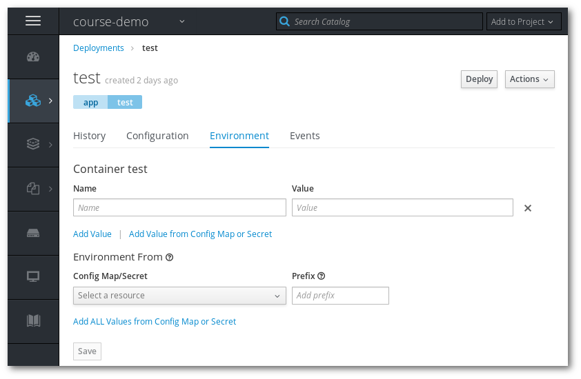
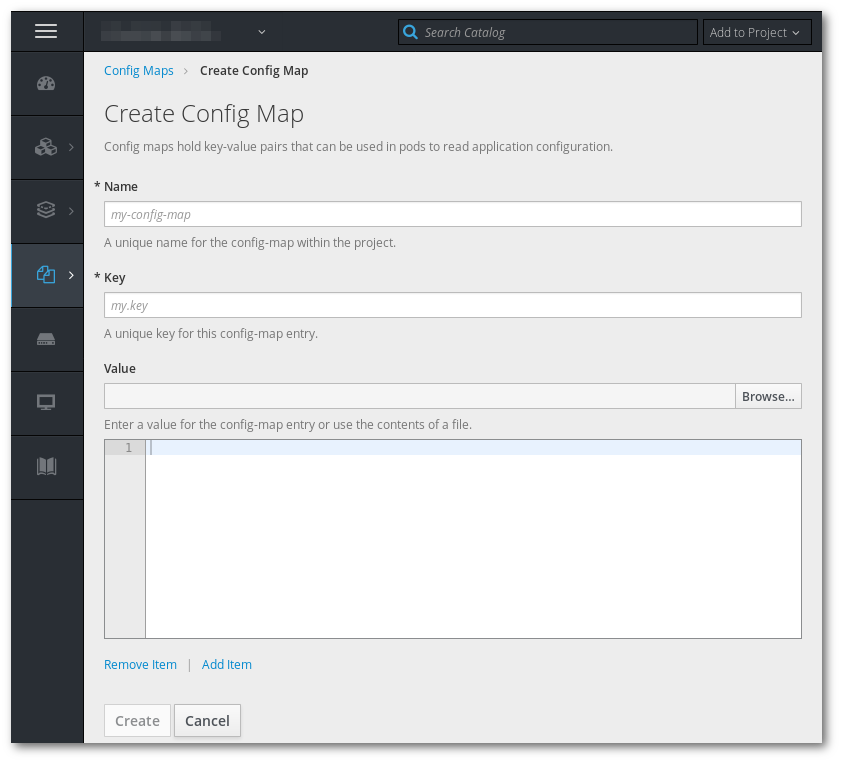

# Add configuration python application

> Pre-requisites, the application created in [Exercise 2](/exercises/A02/index.html)

In this exercise we will add configuration to the application.

## Using environment variables

One simple way of configuring application is using environment variables.

* Go to the environment page of the Deployment and add a variable called *DEBUG* with the content _True_.

* Go now to the logs and check that indeed the DEBUG was activated.

## Using a configmap

In this section, we will use a config map to create a config file.

* Create a configmap, the Key should is the name of the file (config.json), and the content:

*config.json*:
<pre><code>{
  "student": "??????",
  "debug": true
}
</code></pre>

Replace the question marks with your name.

* From the deployment configuration page, use the "Add Config Files" option. Mount the config map you just created and mount it in `/etc/flask`.

* Check your application
